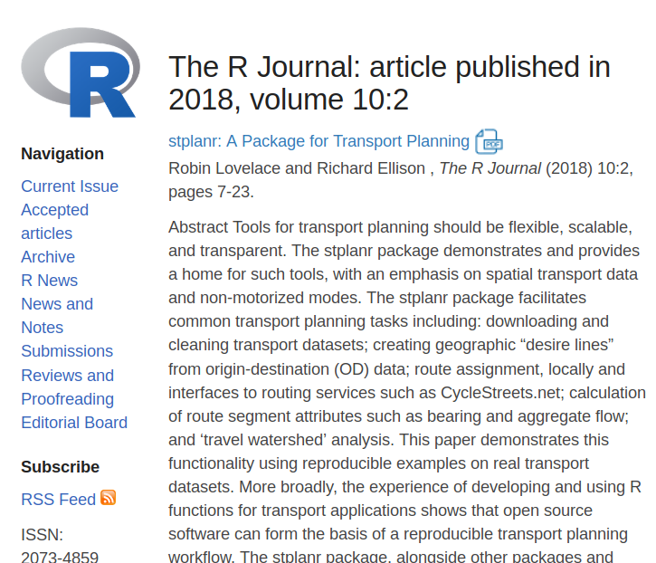
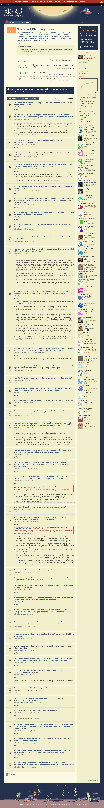

```{r, include=FALSE}
library(tidyverse)
knitr::opts_chunk$set(echo = FALSE)
```


# Abstract

<font color="grey"></font>
<font color="grey">Since the first release of R on CRAN, in 1997, its use in many fields has grown rapidly. Lai et al. (2019), for example, suggest that </font> more than 50% of research articles published in Ecology use R <font color="grey"> in some way.

--

Much like many ecological datasets, </font>transport datasets tend to be large, diverse and have spatial and temporal attributes.<font color="grey">

--

Unlike Ecology, Transport Planning has been a slow adopter of R, with a much lower percentage of papers using the language. This raises the question: why? After exploring this question, in relation to dominant transport planning software products, the talk will sketch of what an open source transport planning 'ecosystem' could look like. Based on my own experience, of developing the stplanr package and teaching practitioners, the talk will discuss the importance of building </font>'communities of practice, for transport planners making the switch to R<font color="grey">. These observations relate to others promoting R in new environments, and link to the wider question of how to advocate for open source software in wider society.</font>

<!-- Context: in this session: http://user2019.r-project.org/talk_schedule/ -->
<!-- 14:00 		Movement & transport 	Rocio Joo -->
<!-- 	Navigating through the R packages for movement 	Angela Li 	Ariane 1+2 	 -->
<!-- 14:18 		Movement & transport 	Mohammad Mehdi Moradi -->
<!-- 	Classes, methods and data analysis for trajectories 	Angela Li 	Ariane 1+2 	 -->
<!-- 14:36 		Movement & transport 	Christine Thomas-Agnan -->
<!-- 	Modelling spatial flows with R 	Angela Li 	Ariane 1+2 	 -->
<!-- 14:54 		Movement & transport 	Robin Lovelace -->
<!-- 	R for Transport Planning 	Angela Li 	Ariane 1+2 -->

---

background-image: url(car-free-leeds.png)
background-size: cover
class: center, top

--

# A dream

Source: [leedscyclingcampaign.co.uk](http://www.leedscyclingcampaign.co.uk/CarFreeSundays)

<!-- Add image from car free day in Leeds -->

---

**The reality**: Source: [photo from run this morning](https://www.flickr.com/photos/97888609@N02/48247197386/in/album-72157709543796761/lightbox/)

<a data-flickr-embed="true" data-context="true"  href="https://www.flickr.com/photos/97888609@N02/48247197386/in/album-72157709543796761/lightbox/" title="IMG_20190710_063516"></a><script async src="//embedr.flickr.com/assets/client-code.js" charset="utf-8"></script>

```{r, echo=FALSE, eval=FALSE}
# remotes::install_github("jimhester/flickrr")
# flickrr::authenticate()
# 
# flickr_GET("flickr.photo.search", text = "UseR2016")
```

---

```{r, echo=FALSE, out.width="50%", fig.cap=""}
knitr::include_graphics("https://pbs.twimg.com/media/DOH94nXUIAAgcll.jpg")
```

Amsterdam in the 1970s. Via [Brent Toderian](https://twitter.com/BrentToderian)

---

```{r, echo=FALSE, out.width="70%", fig.cap=""}
knitr::include_graphics("https://pbs.twimg.com/media/DJaWCo0U8AAzQGW.jpg:large")
```

Amsterdam in the 2010s [Brent Toderian](https://twitter.com/BrentToderian)

For more, see historical photos of Amsterdam, e.g. from [fastcompany.com](https://www.fastcompany.com/3052699/these-historical-photos-show-how-amsterdam-turned-itself-into-a-bike-riders-paradise)


---

background-image: url(road-casualties.png)
background-size: cover
class: left, bottom

Road casualty rates worldwide. Source: WHO. Code: [Robinlovelace/useR2019](https://github.com/Robinlovelace/useR2019)

Transport is the number 1 cause of death among young people (WHO [2018](https://www.who.int/violence_injury_prevention/road_safety_status/2018/en/))


???

- Fast growing source of energy use and pollution 
- No 'upper limit' on use
- Inequalities
- Number 1 cause of death and injury among young people wide

---

# Transport emissions

> With-out  aggressive  and  sustained  mitigation  policies  being  implemented,  transport  sector  emissions  could  increase  faster  than  in  the  other  energy end-use sectors and could lead to more than a doubling of CO2 emissions by 2050. ([IPCC, 2015](https://www.ipcc.ch/site/assets/uploads/2018/02/ipcc_wg3_ar5_full.pdf))

--

Transport is hard to decarbonise  (Creutzig et al. [2015](https://science.sciencemag.org/content/350/6263/911))

--

Technological change is slow and uncertain.
Demand reduction is required. 

International Energy Agency's optimistic '[SDS](https://www.iea.org/weo/weomodel/sds/)' scenario:

```{r, message=FALSE, echo=FALSE, fig.height=4}
transport_data = read_csv("transport-emissions-iea.csv")
transport_data$scenario = "Observed"

g = ggplot(transport_data) +
  geom_line(aes(x = year, y = gtco2))
plotly::ggplotly(g)
```


---

# Why transport planning with R?

- Integration of most transport planning tasks into a single workflow. For example, the Propensity to Cycle Tool ([www.pct.bike](http://www.pct.bike/)) (Lovelace et al. 2017; Goodman et al. 2019)

.pull-left[

- Geographic data

  - Strong geo community
- Reproducibility
  - Transport is inherently part of the democratic process 

- Good transport decision making requires public understanding. R is outstanding at visualisation. 

]

--

.pull-right[


```{r, echo=FALSE, out.width="100%"}
# img = webshot::webshot("https://journal.r-project.org/archive/2018/RJ-2018-053/index.html", vwidth = 800, vheight = 800, zoom = 2)
# img

```

]

## +There is a growing R-transport community

<!-- list pkgs here -->

???

 R has a strong and cohesive spatial community
 
 Transport is inherently part of the democratic desision-making process making transparency key. Reproducibility is a strength of R.

---


background-image: url(https://raw.githubusercontent.com/moveability/moveability/master/demo-lines.png)
background-size: cover
class: center, middle, inverse

# The R for transport landscape

Source [github.com/moveability/moveability](https://github.com/moveability/moveability)

---

### An urban transport hierarchy ([www.smartertransport.uk](https://www.smartertransport.uk/the-urban-transport-hierarchy-defined/))


---

# The R transport ecosystem by mode

.pull-left[


Walking

- [`moveability`](https://github.com/moveability/moveability)
- [walkscoreAPI](https://cran.r-project.org/package=walkscoreAPI)
- [walkalytics](https://github.com/zumbov2/walkalytics) 

Cycling

- [cyclestreets](https://cran.r-project.org/package=cyclestreets)
- [bikedata](https://github.com/ropensci/bikedata)
- [cycleRtools](https://cran.r-project.org/web/packages/cycleRtools/vignettes/cycling_data_analysis.html) (sport cycling)

Public transport

- [tidytransit](https://github.com/r-transit/tidytransit)

Multi-modal transport

- [openrouteservice](https://github.com/GIScience/openrouteservice-r)
- [opentriplanner](https://github.com/ITSLeeds/opentripplanner)

]

--

.pull-right[

```{r, echo=TRUE, eval=FALSE}
# To install these packages:

install.packages(
  "walkscoreAPI",
  "walkalytics",
  "cyclestreets",
  "bikedata",
  "cycleRtools"
  "tidytransit"
  )

remotes::install_github(
  "moveability/moveability",
  "itsleeds/opentripplanner",
  "GIScience/openrouteservice-r"
)

```

]

---


# Transport ecosystem by geographic level

.pull-left[

Area based analysis

- [sf](https://github.com/r-spatial/sf)
- [raster](https://cran.r-project.org/package=raster)
- [INLA](https://paula-moraga.github.io/book-geospatial/) 

Origin destination data

- [stplanr](https://cran.r-project.org/package=raster)
- [flows package](https://cran.r-project.org/web/packages/flows/vignettes/flows.html) 

Routes

- [trajectories](https://cran.r-project.org/package=raster)
- Routing services 

Route networks

- [SpatialLinesNetwork](https://ropensci.github.io/stplanr/reference/SpatialLinesNetwork.html) class
- [sfnetworks](https://github.com/luukvdmeer/sfnetworks) - upcoming blog post: github.com/spnethack/spnethack

]

--

.pull-right[

```{r, echo=TRUE, eval=FALSE}
# To install these packages:

install.packages(
  "sf",
  "raster",
  "stplanr",
  "flows"
  )

remotes::install_github(
  "luukvdmeer/sfnetworks"
)

```

Useful guiding principle in Transport Planning (see [transport](https://geocompr.robinlovelace.net/transport.html) chapter in *Geocomputation with R*)

- Note: there are many other packages for transport planning- not comprehensive lists

]

---

background-image: url(https://raw.githubusercontent.com/npct/pct-team/master/figures/sdna-san-fran.png)
background-size: cover
class: center, middle

--

# Current transport software

## Credit: Crispin Cooper, author of C++ library sDNA

---

.right-column[

### The four stage model

```{r, echo=FALSE}
knitr::include_graphics("https://www.researchgate.net/profile/Marek_Drliciak/publication/271423569/figure/fig1/AS:562670382350336@1511162481936/The-classic-four-stage-transport-model-4.png")
```

Still dominates transport planning models (Boyce and Williams 2015)
]

--

### Software landscape

- Dominated by a few proprietary products

- Limited support community online 

- High degree of lock-in

- Limited cross-department collaboration

---

# Existing products

```{r, echo=FALSE, message=FALSE, warning=FALSE}
tms = readr::read_csv("transport-software.csv")[1:5]
# tms = dplyr::arrange(tms, dplyr::desc(Citations))
tms = tms[order(tms$Citations, decreasing = TRUE),]
knitr::kable(tms, booktabs = TRUE, caption = "Sample of transport modelling software in use by practitioners. Note: citation counts based on searches for company/developer name, the product name and 'transport'. Data source: Google Scholar searches, October 2018.", format = "html")
```

---

# User support

Getting help is vital for leaning/improving software

--

```{r, eval=FALSE}
webshot::webshot("https://area51.stackexchange.com/proposals/121498/transport-planning", "transport-planning-proposal.png")
```

```{r}

```


<!-- --- -->

<!-- # Online communities -->

<!-- - [gis.stackexchange.com](https://gis.stackexchange.com/questions) has 21,314 questions  -->

<!-- - [r-sig-geo](http://r-sig-geo.2731867.n2.nabble.com/) has 1000s of posts -->

<!-- - RStudio's Discourse community has 65,000+ posts already! -->

<!-- -- -->

<!-- - No transport equivalent (e.g. earthscience.stackexchange.com is in beta) -->

<!-- - Potential for a Discourse forum or similar: transport is not (just) GIS -->

<!-- --- -->

<!-- # Best way to get support is peer-to-peer: -->

<!--  -->

<!-- Source: https://community.rstudio.com/about -->

---

# Transport planning is PRICEY


"10-Hour Service Pack $2,000" (source: [caliper.com/tcprice.htm](https://www.caliper.com/tcprice.htm))

```{r, echo=FALSE}
knitr::include_graphics("https://www.robinlovelace.net/presentations/price-transcad.png")
```

Source: [google.com/search?q=transcad+price](https://www.google.com/search?q=transcad+price)

---

background-image: url(https://media.giphy.com/media/YlQQYUIEAZ76o/giphy.gif)
background-size: cover
class: center, middle


# Where next for R-transport?

---

# Questions and suggestions

- Shift focus to communication of what's *already possible*

- 'Dev story' of existing products: A 'Better planning in less time' article, building on Lowndes et al. ([2017](https://jules32.github.io/opensci-talk/short#1))? E.g. for ([PCT.bike](http://www.pct.bike/)) 

- For developers: invite others to contribute and open issues

- For potential developers: consider contributing to existing projects before creating new ones

- For everyone: cite code, communicate, collaborate

--

## Questions

- Is there a need for a 'transportverse'?
- How can we best take this forward?

---

class: center, bottom, inverse


# Credits, references and further links

--

Boyce, D.E., Williams, H.C.W.L., 2015. Forecasting Urban Travel: Past, Present and Future. Edward Elgar Publishing.

--

The Propensity to Cycle Tool: http://www.pct.bike/ Lovelace, R., Goodman, A., Aldred, R., Berkoff, N., Abbas, A., Woodcock, J., 2017. The Propensity to Cycle Tool: An open source online system for sustainable transport planning. Journal of Transport and Land Use 10. https://doi.org/10.5198/jtlu.2016.862

--

Goodman, Anna, et al. "Scenarios of cycling to school in England, and associated health and carbon impacts: Application of the ‘Propensity to Cycle Tool’." Journal of Transport & Health 12 ([2019](https://www.sciencedirect.com/science/article/pii/S2214140518301257)): 263-278.

--

Open source 'geocompr' book: Lovelace, R., Nowosad, J., Meunchow, J., 2019. Geocomputation with R. CRC Press: https://geocompr.robinlovelace.net/

--

Lovelace, Robin, and Richard Ellison. "stplanr: A package for transport planning." The R Journal 10.2 ([2018](https://journal.r-project.org/archive/2018/RJ-2018-053/index.html)): 7-23. 

--

To get in touch: [GitHub](https://github.com/robinlovelace/), [Twitter](https://twitter.com/robinlovelace),  or email at r. lovelace. at leeds dot ac. uk!

--

Safe travels!

---

# Other things: future of transport planning

- Example: StreetMix ([streetmix.net](https://streetmix.net/))

```{r, echo=FALSE, out.width="60%"}
knitr::include_graphics("http://1p40p3gwj70rhpc423s8rzjaz-wpengine.netdna-ssl.com/wp-content/uploads/2016/03/2016_0211_2ndAvePioneerSquareFlyer-streetmix.jpg")
```

---

# Sumo and netlogo

```{r, echo=FALSE, out.width="70%"}
knitr::include_graphics("https://user-images.githubusercontent.com/1825120/46748345-41c98580-ccab-11e8-8093-b265bd36f639.gif")
```

Source: [github.com/eclipse/sumo](https://github.com/eclipse/sumo/issues/2409)

.pull-left[

```{r, echo=FALSE, out.width="20%"}
knitr::include_graphics("https://raw.githubusercontent.com/nldoc/nlrx/master/man/figures/logo.png")
```

]

Source: [github.com/nldoc/nlrx](https://github.com/nldoc/nlrx)

---

### Gamification

```{r, echo=FALSE}
knitr::include_graphics("https://www.robinlovelace.net/presentations/citybound.png")
```

- Completely open source, written in [rust](https://github.com/citybound/citybound)
- Source: video at https://aeplay.org/citybound
